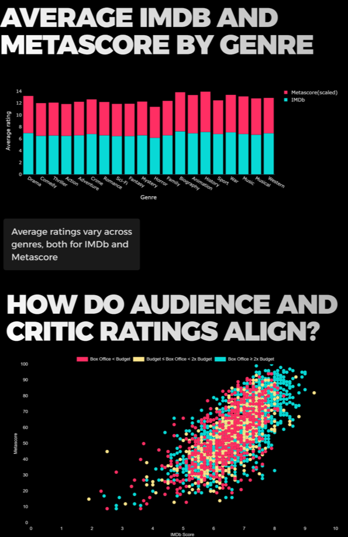
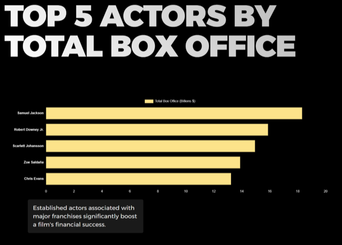

# Data_Wrangling_Visualization_Project
## Checkpoint 1:
At this stage, our team:
1. Collected data from the imdb website about 4,000 films using Scrapy
2. Cleaned and preprocessed data about films
3. Prepared Advanced Data Analysis including analysis of the completeness of the dataset

## Checkpoint 2:
For the second checkpoint, our team:
1. Prepared a full analysis of the dataset
2. Developed a unique interactive website with a stylish modern design
3. Conducted an analysis of patterns between research factors such as:
- IMDB rating
- Metascore rating
- Genre
- Year of creation
- Box office receipts
- Production budget
- Popularity of the cast
4. Added interactive graphs visualizing these dependencies to the website

## Repository structure:
### In the data_wrangling folder you can find files created before checkpoint 1:
- In the *starwars* folder there is code for web scraping of the site. 
- Scraped data is in the *films_data.json* file
- In the *data_preparation.ipynb* and *Advanced_Data_Analysis.ipynb* files there is code for cleaning and analyzing the dataset
- Cleaned and grouped datasets can be found in the *data* folder
### The img folder:
There are screenshots of our site
### In the static folder there are: 
- *assets* folder - it contains various icons and pictures for the site
- *lib* folder - it contains library files for the site
- *index.html*
- *script.js*
- *Styles.css*
### Also in the main repository is the file app.py 
This file contains all the main functions for the site

## Screenshots of the website
Below are attached screenshots of our website:

$ flask run --port=8080
$ http://127.0.0.1:8000
